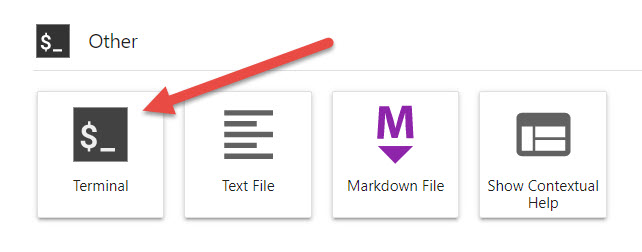

# RFSoC Xilinx Adapt 2021 Demonstration
This repository hosts the RFSoC OFDM and Spectrum Analyser demonstration for Xilinx Adapt 2021.

The RFSoC design in this repository presents a ‘live’ SDR demonstration of RFSoC-PYNQ with two physical (PHY) layer mobile/cellular radio receiver designs for an 80MHz radio transceiver (4 channels x 20 MHz bands), one with a center frequency of 700MHz and the other at 3.5GHz. To visualize the radio receiver signals, the system uses an open-source spectrum analyzer running on the RFSoC to demonstrate the channelization and RF sampling at 700MHz and 3.5GHz.

<p align="center">
  
</p>

## Quick Start
Follow the instructions below to install the demonstration system. **You will need to give your board access to the internet**.
* Power on your RFSoC2x2 development board with an SD Card containing a fresh PYNQ v2.6 image.
* Navigate to Jupyter Labs by opening a browser (preferably Chrome) and connecting to `http://<board_ip_address>:9090/lab`.
* We need to open a terminal in Jupyter Lab. Firstly, open a launcher window as shown in the figure below:

<p align="center">
  
</p>

* Now open a terminal in Jupyter as illustrated below:

<p align="center">
  
</p>

Now follow the board specific setup instructions as follows. Please pay particular attention to the steps involved.

## RFSoC2x2 Setup
Your RFSoC2x2 development board already comes preinstalled with the Spectrum Analyser and Voila 0.1.13. We can install the RFSoC Xilinx Adapt demonstration by running the following code:

```sh
pip3 uninstall rfsoc-sam
pip3 install git+https://github.com/strath-sdr/rfsoc_xilinx_adapt@v0.1.0
```

This will forcefully install the required version of the Spectrum Analyser to your development board. You will find the Spectrum Analyser notebooks in the Jupyter workspace directory. The folder will be named 'spectrum-analyzer'. The Xilinx Adapt demonstration notebooks will also be placed in your Jupyter workspace. The folder will be named 'rfsoc-xilinx-adapt'.

## Using the Project Files
The following software is required to use the project files in this repository.
- Vivado Design Suite 2020.1
- System Generator for DSP
- MATLAB R2020a

### Vivado
This project can be built with Vivado from the command line. Open Vivado 2020.1 and execute the following into the tcl console:
```sh
cd /<repository-location>/boards/<board-name>/rfsoc_sam/
```
Now that we have moved into the correct directory, make the Vivado project by running the make commands below sequentially.
```sh
make project
make block_design
make bitstream_file
```

Alternatively, you can run the entire project build by executing the following into the tcl console:
```sh
make all
```

## License 
[BSD 3-Clause](../../blob/master/LICENSE)
